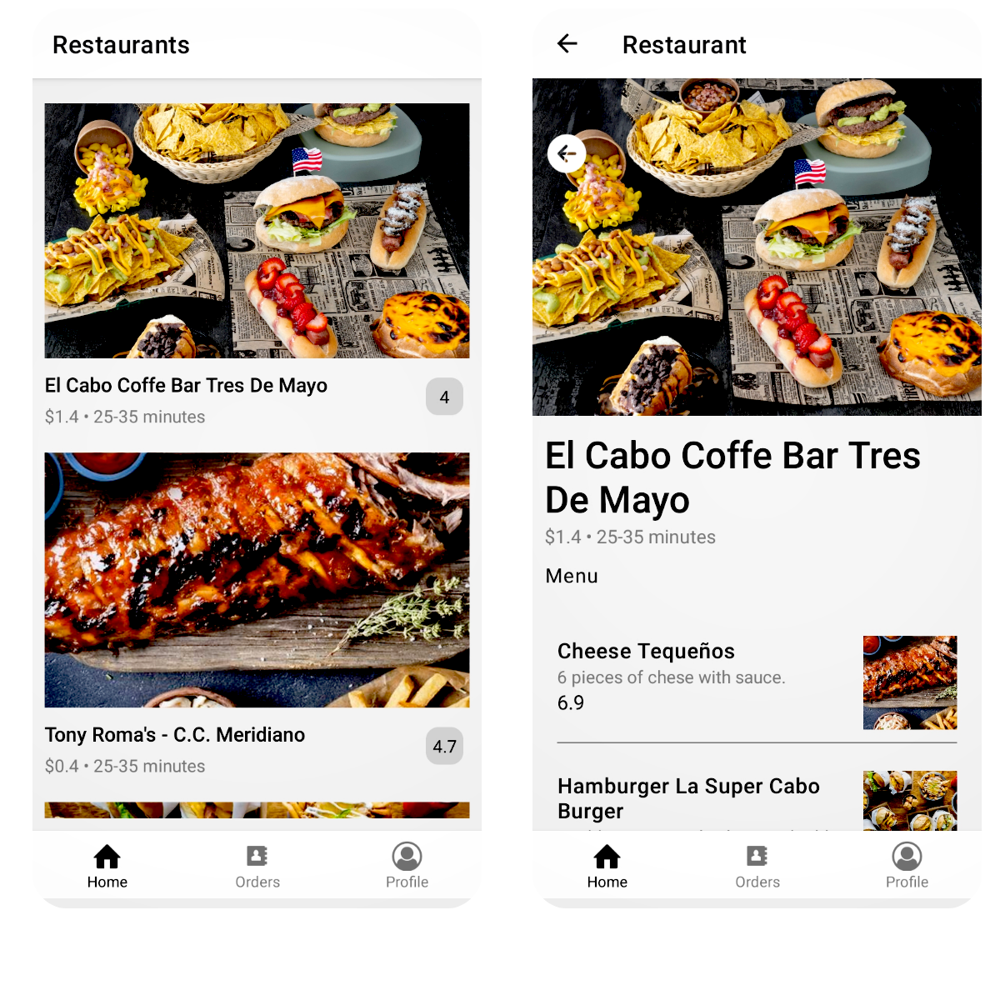
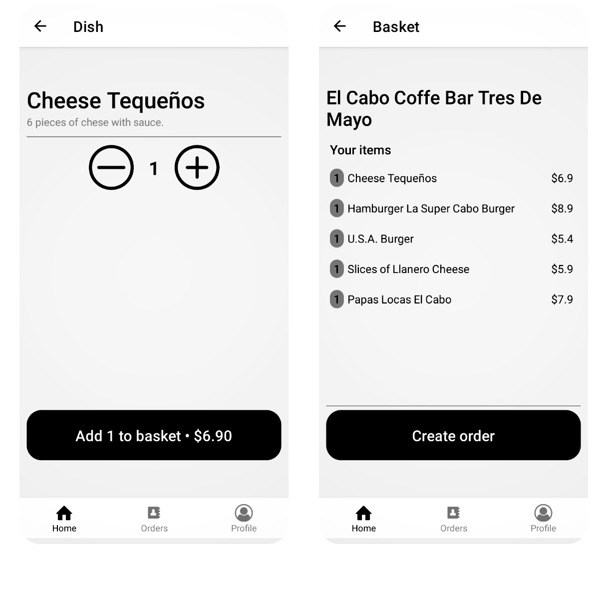
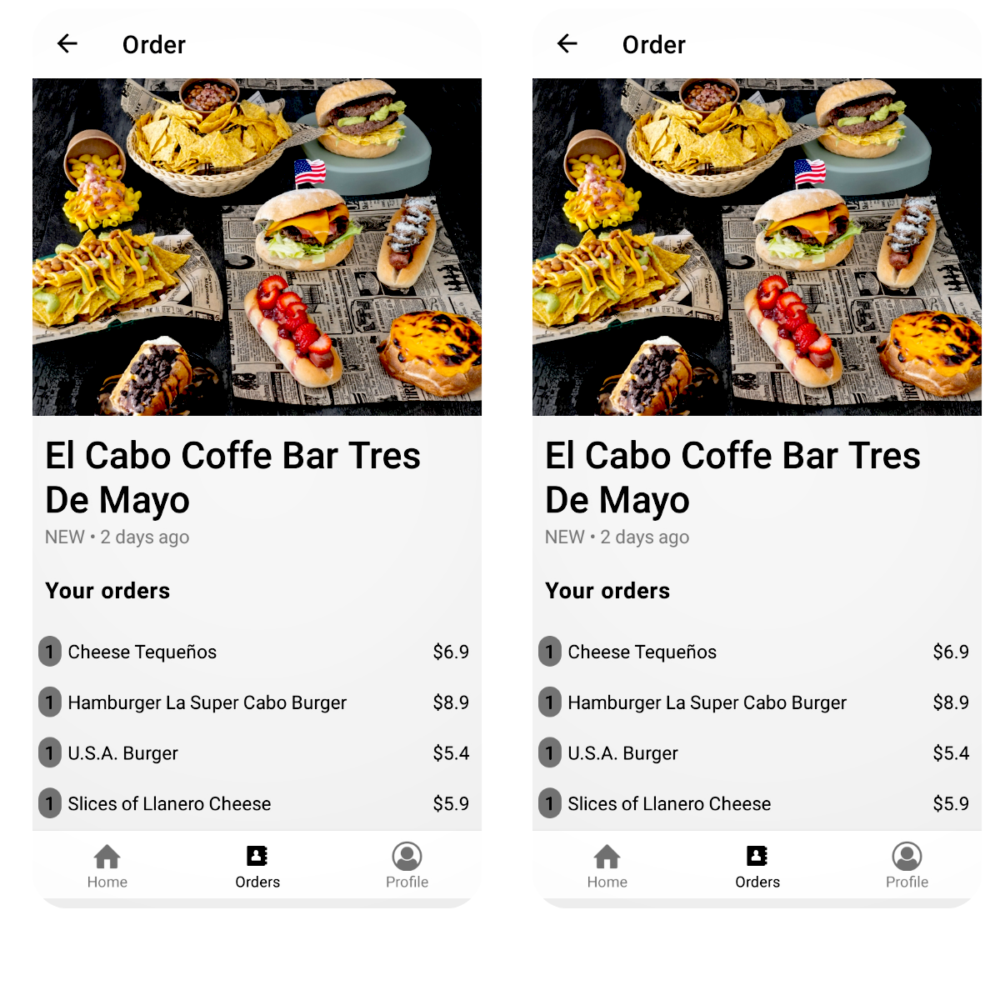

# Project Description

This is a Front-End User side of the Uber-Eats app. User can search through different restaurants and see availabe dish, Add to basket and view order. I built the backend using aws amplify....contact me for the backend  

#Installation

Please set up a React Native development environment if you have not already done so.
You will also need to install dependencies:
npm i\

# Running iOS on a Mac via a simulator

Make sure you have a version of CocoaPods installed, and run the following commands:

npm i\
cd ios\
pod install\
cd ..\
npm react-native run-ios

# Running Android on a Mac or PC

Attach a device or run an emulator and run the following commands:

npm i\
npm react-native run-android

# Screenshots

# Ideas for Future Development
*Add a Splash Screen.\
*Add an app icon.
